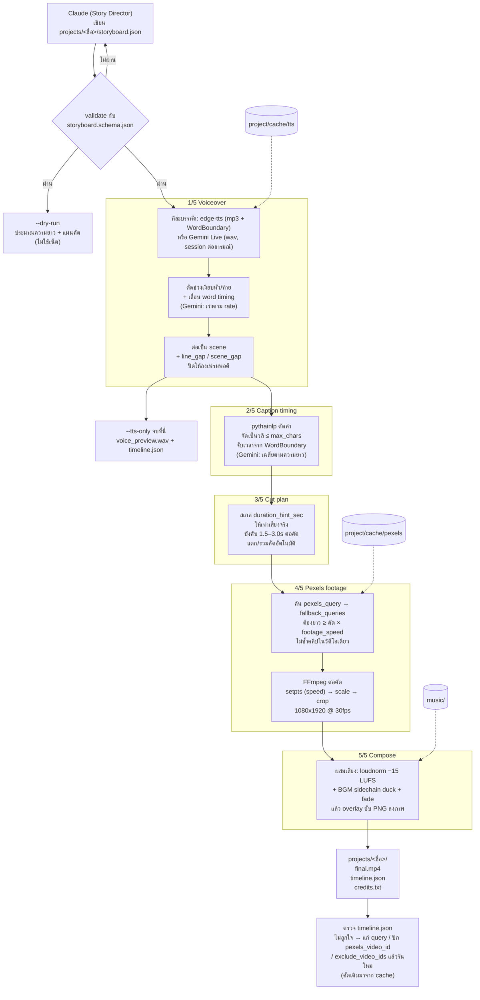

# Pipeline และคู่มือสร้างวิดีโอใหม่

เอกสารนี้อธิบายว่า `render_shorts.py` เปลี่ยน `storyboard.json` เป็นคลิป Shorts อย่างไร และขั้นตอนทำคลิปใหม่ตั้งแต่ให้ Claude เขียน storyboard จนได้ไฟล์ mp4

## ภาพรวม Pipeline



### แต่ละขั้นทำอะไร

| ขั้น | Input | Output | จุดที่ปรับได้ |
|---|---|---|---|
| Validate | `storyboard.json` | storyboard ที่ผ่าน schema | `storyboard.schema.json` |
| 1. Voiceover | `narration_lines`, `voice`, `emotion` ของ scene | เสียงแต่ละ scene (ลงเฟรมพอดี) | `voice.engine`, `voice_id`, `rate`, `style` (Gemini), `line_gap_sec`, `scene_gap_sec`, `trim_silence`, `pronunciations`, `scenes[].emotion` (Gemini) |
| 2. Caption timing | ข้อความ + word timing | วลีซับพร้อมเวลา | `subtitles.max_chars`, `min_chars`, `emphasis_words` |
| 3. Cut plan | `cuts[].duration_hint_sec` + ความยาวเสียงจริง | ความยาวจริงของแต่ละคัต | `render.min_cut_sec`, `max_cut_sec` |
| 4. Footage | `pexels_query`, `fallback_queries`, `pexels_video_id`, `exclude_video_ids` | คลิป 1080x1920 ต่อคัต | `render.footage_speed`, `--refresh-footage`, `--seed` |
| 5. Compose | วิดีโอ + เสียง + ซับ + เพลง | `final.mp4` | `bgm.volume`, `bgm.duck_ratio`, `bgm.start_sec`, `bgm.file`, `--no-subs`, `--no-bgm` |

ค่า default ของตัวปรับหลักอยู่เป็น constant ที่หัว `render_shorts.py` (`TTS_*`, `FOOTAGE_SPEED`, `BGM_VOLUME`, `BGM_DUCK_RATIO`, `BGM_START_SEC`, `EST_CHARS_PER_SEC`, `EST_CHARS_PER_SEC_GEMINI`, `AUDIO_GAP_WARN_SEC`) และของ Gemini อยู่ที่หัว `tts_gemini.py` (`GEMINI_LIVE_MODEL`, `DEFAULT_VOICE`, `MIN_SIMILARITY`) ค่าที่ใส่ใน storyboard จะใช้แทน default

### ไฟล์ที่เกิดขึ้น

ทุกอย่างของคลิปหนึ่งอยู่ใน `projects/<ชื่อ>/` เสร็จงานแล้วลบทั้งโฟลเดอร์ได้เลย

| ที่อยู่ (ใน `projects/<ชื่อ>/`) | คืออะไร | ลบได้ไหม |
|---|---|---|
| `storyboard.json` | บทและแผนคัต (input) | ไม่ควร |
| `final.mp4` | วิดีโอผลลัพธ์ (เปลี่ยนชื่อได้ด้วย `-o`) | ผลลัพธ์ |
| `timeline.json` | เวลาและ Pexels id ของทุกคัต + warnings | ผลลัพธ์ |
| `credits.txt` | เครดิตฟุตเทจสำหรับใส่คำอธิบายคลิป | ผลลัพธ์ |
| `voice_preview.wav` | เสียงพากย์จาก `--tts-only` | ได้ |
| `cache/tts/` | เสียงต่อบรรทัด: edge-tts เป็น mp3 + word timing (key = ข้อความ + voice + rate + pitch), Gemini เป็น wav ความเร็วดิบ (key = ข้อความ + voice + style + emotion — เปลี่ยน `rate` จึงไม่ต้องเรียก API ใหม่) | ได้ แต่จะต้องเจนเสียงใหม่ (Gemini เสียโควตา) |
| `cache/pexels/` | ผลค้นหาและไฟล์ฟุตเทจ | ได้ แต่จะต้องค้นและโหลดใหม่ และคลิปที่ได้อาจเปลี่ยน |
| `build/` | ไฟล์ชั่วคราวระหว่างเรนเดอร์ (ลบเองเมื่อสำเร็จ ยกเว้นใช้ `--keep-temp`) | ได้ |

> `timeline.json`, `credits.txt` และ `voice_preview.wav` ถูกเขียนลงโฟลเดอร์เดียวกับวิดีโอเสมอ ถ้าใช้ `-o` ชี้ออกนอก project ไฟล์พวกนี้จะไปอยู่ที่นั่นด้วย

---

## คู่มือสร้างวิดีโอใหม่

> ทางลัด: `python app.py` แล้วใช้แท็บ "สร้างใหม่" ใน GUI ซึ่งทำขั้นที่ 1–5 ด้านล่างให้ในหน้าเดียว (ดู README หัวข้อ "ใช้ผ่าน GUI") ส่วนนี้อธิบายการทำผ่าน command line

### 0. เตรียมครั้งแรก (ทำครั้งเดียว)

```bash
cd auto-shorts
source .venv/bin/activate          # ทุกคำสั่งด้านล่างสมมติว่า activate แล้ว
python -c "from PIL import features; print(features.check('raqm'))"   # ต้องได้ True
grep -q your_pexels_api_key_here .env && echo "ยังไม่ได้ใส่ PEXELS_API_KEY"
ls music/                          # มีเพลงอย่างน้อย 1 ไฟล์ (ไม่มีก็เรนเดอร์ได้ แต่ไม่มี BGM)
```

### 1. ให้ Claude เจน storyboard

คัดลอก prompt ชุดเดียวจาก [`storyboard-prompt.md`](storyboard-prompt.md) ไปวางในแชต Claude แล้วแก้หัวข้อ ความยาว และโทน ไม่ต้องแนบไฟล์ เพราะกฎของ schema ทั้งหมดอยู่ในข้อความแล้ว

บันทึกผลเป็น `projects/<ชื่อ>/storyboard.json` เช่น

```bash
mkdir -p projects/my_clip
# วาง JSON ลงไฟล์ projects/my_clip/storyboard.json
```

ชื่อ project ใช้ได้เฉพาะ a–z, A–Z, 0–9, `-` และ `_`

### 2. ตรวจโครงสร้างและดูแผน (ไม่ใช้เน็ต)

```bash
python render_shorts.py my_clip --dry-run
```

สิ่งที่ต้องดู:
- **ผ่าน schema** ถ้าไม่ผ่าน ให้ส่ง error กลับให้ Claude แก้
- **`≈ XXs estimated`** ควรอยู่ในช่วง 40–50s และห้ามเกิน 60s (ค่าประมาณคลาดจริงราว ±3%)
- **`N cuts (≈M needed)`** ถ้า N ห่างจาก M มาก ระบบจะแตกหรือรวมคัตเอง ควรให้ Claude เพิ่มหรือลดคัตให้ใกล้ M

### 3. เจนเสียงอย่างเดียวเพื่อฟังก่อน

```bash
python render_shorts.py my_clip --tts-only
open projects/my_clip/voice_preview.wav
```

- ฟังการออกเสียง ถ้าคำไหนอ่านผิด ให้เพิ่มใน `voice.pronunciations` แล้วรันใหม่ (ซับยังแสดงข้อความเดิม)
- ดูความยาวจริงที่ `total voice: XXs`
- ขั้นนี้ยังไม่ใช้ Pexels quota เสียงที่เจนแล้วจะถูก cache ไว้ใช้ตอนเรนเดอร์จริง (ถ้าใช้ Gemini ขั้นนี้คือขั้นที่ใช้โควตา Gemini)
- ถ้าใช้ Gemini ซับจะจับเวลาแบบเฉลี่ย และถ้ามีบรรทัดที่อ่านไม่ตรงบท จะขึ้น warning `Gemini read a line differently`

### 4. เรนเดอร์จริง

```bash
python render_shorts.py my_clip
open projects/my_clip/final.mp4
```

### 5. ตรวจผลและแก้ (Human-in-the-loop)

```bash
# ดู warnings
python -c "import json;[print('-',w) for w in json.load(open('projects/my_clip/timeline.json'))['warnings']]"

# ดูว่าแต่ละคัตใช้คลิปไหน
python -c "
import json
for s in json.load(open('projects/my_clip/timeline.json'))['scenes']:
    for c in s['cuts']:
        print(c['cut_id'], c['pexels_video_id'], c['query_used'], c['pexels_url'])"
```

| อาการ | วิธีแก้ |
|---|---|
| คัตไหนภาพไม่ตรงบท | ใส่ `"pexels_video_id": <id>` ในคัตนั้น, ใส่ `"exclude_video_ids": [<id>]` เพื่อให้ระบบเลือกคลิปถัดไป หรือแก้ `pexels_query` แล้วรันใหม่ (คัตอื่นจะได้คลิปเดิมจาก cache) |
| ได้คลิปเดิมทั้งที่แก้ query แล้ว | เพิ่ม `--refresh-footage` |
| อยากได้จุดเริ่มคลิปหรือเพลงแบบอื่น | `--seed 7` (หรือเลขอื่น) |
| `needs N cuts (storyboard has M)` | บทยาวเกินกว่าจำนวนคัต → เพิ่มคัตหรือตัดบท |
| `dropped cut(s)` | scene สั้นเกินกว่าจะใส่ทุกคัต → ลดคัตหรือเพิ่มบท |
| `upscaled` | คลิปความละเอียดต่ำ → ปักคลิปใหม่หรือเปลี่ยนคีย์เวิร์ด |
| `looping a shorter clip` | คลิปสั้นกว่า คัต × `footage_speed` → เปลี่ยน query เป็นฉากที่มีคลิปยาวกว่า |
| เสียงพูดชิดกันเกินไป | เพิ่ม `voice.line_gap_sec` (0.03–0.08) หรือ `scene_gap_sec` (0.1–0.2) |
| พยัญชนะท้ายคำขาด | เพิ่ม `TTS_KEEP_TAIL_SEC` ที่หัว `render_shorts.py` |
| เพลงดัง/เบาเกิน | ปรับ `bgm.volume` และ `bgm.duck_ratio` (ratio ต่ำ = เพลงดังใต้เสียงพูดมากขึ้น) |
| ช่วงแรกของเพลงไม่เข้ากับเนื้อหา | ตั้ง `bgm.start_sec` เป็นวินาทีที่อยากให้เพลงเริ่ม และตั้ง `bgm.file` เพื่อล็อกเพลง (ถ้าเพลงสั้นกว่าคลิป รอบที่วนซ้ำจะเริ่มจาก 0) |
| `No audio was received` | voice นั้นล่มฝั่ง Microsoft → ทดสอบด้วย `edge-tts --voice <id> --text "ทดสอบ" --write-media test.mp3` แล้วเปลี่ยน `voice_id` หรือใช้ `"engine": "gemini"` |
| `Gemini Live quota used up` | โควตา Gemini หมด → บรรทัดที่ทำแล้วอยู่ใน cache รอรีเซ็ตแล้วรันต่อ หรือเปลี่ยนเป็น edge-tts |
| `Gemini read a line differently` | ฟังบรรทัดนั้น ถ้าผิดจริงให้แก้ประโยคหรือ `style` แล้วรันใหม่ |
| เสียง Gemini ยาวเกิน | เพิ่ม `voice.rate` (ไม่เสียโควตา) หรือใส่ "พูดเร็ว" ใน `style` (สร้างเสียงใหม่) |

### 6. เผยแพร่

- คัดลอกเนื้อหาใน `projects/my_clip/credits.txt` ไปใส่ในคำอธิบายคลิป
- ใช้เฉพาะเพลงที่คุณมีสิทธิ์ใช้

### สรุปคำสั่ง

```bash
python render_shorts.py <ชื่อ> --dry-run      # ตรวจ + ประมาณความยาว
python render_shorts.py <ชื่อ> --tts-only     # เสียงอย่างเดียว
python render_shorts.py <ชื่อ>                # เรนเดอร์จริง → projects/<ชื่อ>/final.mp4
rm -rf projects/<ชื่อ>                        # เสร็จงานแล้วลบทั้ง project

# flags เสริม
--no-subs            # ไม่ใส่ซับ
--no-bgm             # ไม่ใส่เพลง
--seed 7             # เปลี่ยนจุดเริ่มคลิปและเพลง
--refresh-footage    # ค้น Pexels ใหม่ ไม่ใช้ cache
--keep-temp          # เก็บ projects/<ชื่อ>/build/ ไว้ debug
--progress           # พิมพ์ความคืบหน้าเป็น JSON (ที่ GUI ใช้ทำ progress bar)
-o v2.mp4            # ตั้งชื่อไฟล์วิดีโอเอง (อยู่ใน project)
```
